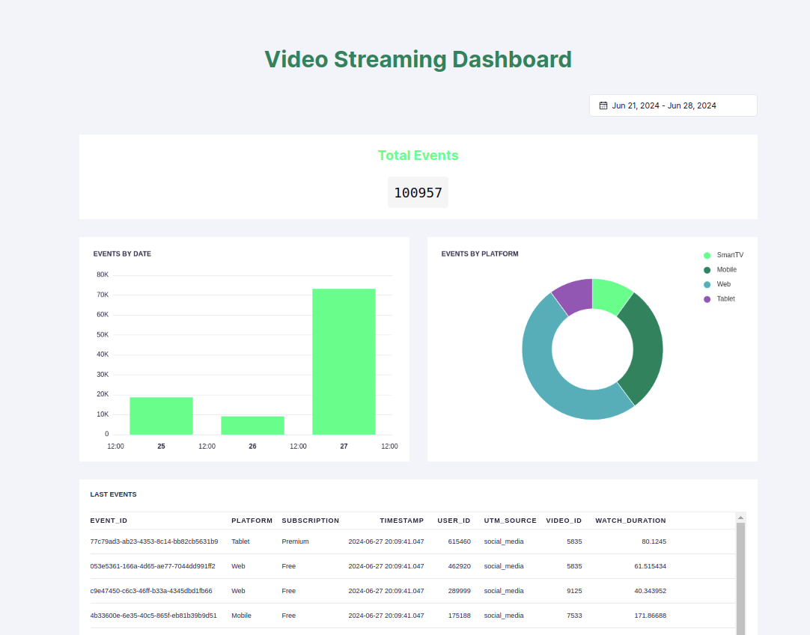

# Video Streaming Dashboard

This is a [Next.js](https://nextjs.org/) project built over Tinybird project.



## Getting Started

1. Create a Python virtual environment:

```bash
python3 -m venv .video-streaming-dashboard-env
source .video-streaming-dashboard-env/bin/activate
```

2. Install all dependencies:

```bash
pip install -r requirements.txt
```

```bash
curl -o- https://raw.githubusercontent.com/nvm-sh/nvm/v0.39.3/install.sh | bash
nvm install 18.17.0
nvm use 18.17.0
npm install -g npm@latest
npm install -g pnpm@7.30.5
pnpm install
```

3. Start the Tinybird project:

```bash
tb auth --token your_token
tb init --folder tinybird
```
## Tinybird Project

The structure of this Tinybird project is as follows:

```
tinybird
├── datasources
│   └── video_events.datasource
└── pipes
    ├── get_events_by_date.pipe
    ├── get_events_by_platform.pipe
    ├── get_last_events.pipe
    └── get_total_events.pipe
```

All endpoints are fed by the `video_events` data source. This has an `APPEND` only TOKEN and the endpoints shared the same `READ` only TOKEN.

## Start streaming data with Mockingbird

In the `data-generator` folder there is a Mockingbird schema that you could use in [Mockingbird](https://mockingbird.tinybird.co/) to start streaming data into `video_events`:

<details>
```json
{
    "timestamp": {
      "type": "mockingbird.timestampNow"
    },
    "event_id": {
      "type": "string.uuid"
    },
    "user_id": {
      "type": "number.int",
      "params": [
        {
          "min": 100000,
          "max": 999999
        }
      ]
    },
    "platform": {
      "type": "mockingbird.pickWeighted",
      "params": [
        {
          "values": [
            "Web",
            "Mobile",
            "SmartTV",
            "Tablet"
          ],
          "weights": [
            50,
            30,
            10,
            10
          ]
        }
      ]
    },
    "video_id": {
      "type": "number.int",
      "params": [
        {
          "min": 5000,
          "max": 10000
        }
      ]
    },
    "subscription": {
      "type": "mockingbird.pickWeighted",
      "params": [
        {
          "values": [
            "Free",
            "Basic",
            "Premium",
            "VIP"
          ],
          "weights": [
            60,
            20,
            15,
            5
          ]
        }
      ]
    },
    "watch_duration": {
      "type": "number.float",
      "params": [
        {
          "min": 1.0,
          "max": 180.0
        }
      ]
    },
    "utm_source": {
      "type": "mockingbird.pickWeighted",
      "params": [
        {
          "values": [
            "email",
            "social_media",
            "ads",
            "direct"
          ],
          "weights": [
            20,
            50,
            25,
            5
          ]
        }
      ]
    }
  }
```
</details>

As a result you will get an ndjson file like with lines like this:

```json
{
"timestamp":"2024-06-26T09:19:04.630Z",
"event_id":"0f198e92-b53e-4905-a82a-4b1a5f2a3bf7",
"user_id":600632,"platform":"Web","video_id":6012,
"subscription":"Basic",
"watch_duration":111.85545799834654,
"utm_source":"social_media"
}
``` 

## Launch Nextjs app

First, create a `.env` (you can use `.env.local` as template) file in the root of the project and add the following:

```bash
NEXT_PUBLIC_DASHBOARD_TOKEN=your_token
```

Then, run the development server:

```bash
pnpm dev
```

Open [http://localhost:3000](http://localhost:3000) with your browser to see the result
